# E-commerce Sales Analytics

This is an end-to-end data analytics project that I built using PostgreSQL, Python and Power BI.

The project is based on a synthetic e-commerce dataset. I started by designing a relational database in PostgreSQL and generating the data with SQL. Then I used SQL to answer business questions and prepare the data for further analysis. I continued the analysis in Python and finished the project by building an interactive four-page Power BI dashboard.

My main goal was to go through the complete analytics workflow and understand how the same business data can be explored from different perspectives: revenue, profit, customers, products, categories, locations, discounts and sales growth.

Tools used:
- PostgreSQL
- SQL
- Python
- pandas
- NumPy
- Matplotlib
- Jupyter Notebook
- Power BI
- DAX

# Project workflow

I divided the project into several stages:

1. Database design and data generation in PostgreSQL
2. Business analysis with SQL
3. Creation of reusable SQL views and indexes
4. Export of the analytical dataset to CSV
5. Exploratory and business analysis in Python
6. Data modeling and calculations in Power BI
7. Creation of an interactive four-page dashboard

This allowed me to work with the project as a complete analytical process rather than treating SQL, Python and Power BI as separate exercises.

# Database and SQL

The first part of the project was built in PostgreSQL.

I created a relational database containing the following main tables:

- customers
- categories
- products
- orders
- order_items

The tables are connected using primary and foreign keys. I also added constraints to keep the generated data consistent.

Because the project does not use confidential company data, I generated a synthetic e-commerce dataset directly in PostgreSQL. This gave me control over the database structure while still allowing me to work with a dataset large enough for meaningful analysis.

The SQL part of the project includes:

- database and table creation
- data generation
- JOIN operations between multiple tables
- CASE expressions
- aggregate functions
- date-based analysis
- revenue and profit calculations
- customer and product analysis
- sales analysis by city
- payment method analysis
- discount analysis
- order status analysis
- monthly sales analysis
- SQL views
- indexes

Some of the main business questions I explored with SQL were:

- Which products generate the most revenue?
- Which products generate the most profit?
- Which categories perform best?
- Who are the highest-value customers?
- Which cities generate the most sales?
- What is the average order value?
- How are completed, cancelled and pending orders distributed?
- Which payment methods are used most often?
- How do discounts affect revenue and profit?
- How do sales change from month to month?

The SQL scripts are organized in execution order inside the `sql` directory:

```text
sql/
├── 01_database_setup.sql
├── 02_insert_orders.sql
├── 03_business_analysis.sql
├── 04_views.sql
├── 05_generate_large_dataset.sql
└── 06_indexes.sql
```

# Python analysis

After the SQL part, I exported the analytical dataset and continued working with it in Python.

The analysis is available in:

```text
python/sales_analysis.ipynb
```

I used pandas for data manipulation, NumPy for numerical operations and Matplotlib for visualization.

The Python part gave me an opportunity to look at the data from another perspective and perform analyses that were useful for understanding trends and customer behavior.

One of them was month-over-month revenue growth.

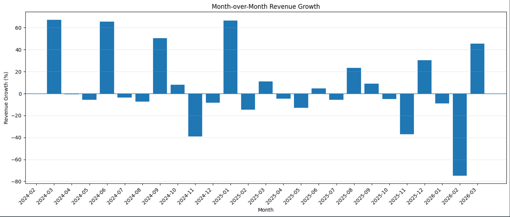

I also compared monthly revenue and profit to see how both metrics changed over time.

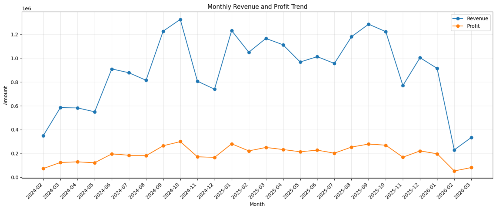

Another part of the analysis was customer revenue concentration. I used a Pareto-style analysis to understand how much of total revenue is generated by the highest-value customers.

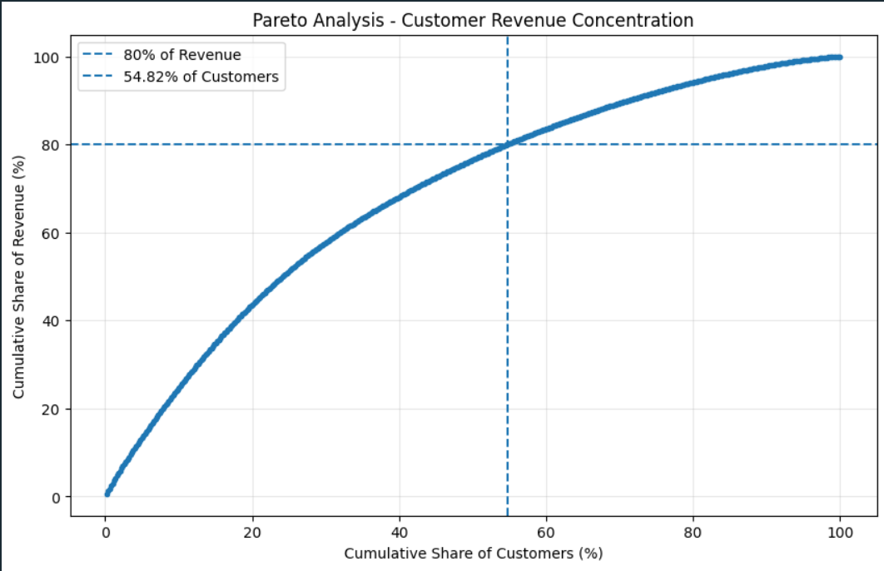

Finally, I compared profit across product categories.

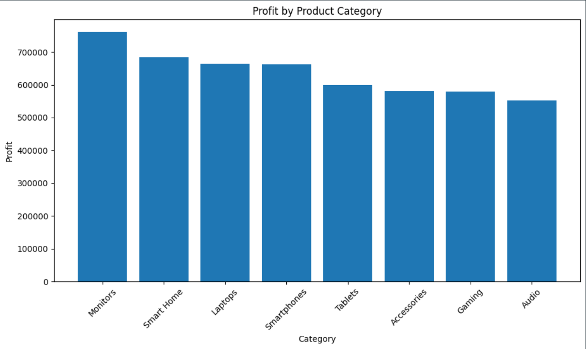

The Python notebook contains the full analysis, calculations and visualizations rather than only the final charts shown here.

# Power BI dashboard

The final stage of the project was creating an interactive Power BI dashboard.

I used the prepared data to create measures, KPIs and visualizations that make it possible to explore the business from several different perspectives.

Instead of putting everything on one page, I divided the dashboard into four pages.

Sales Overview

The first page gives a general view of business performance. It focuses on the main sales KPIs and overall trends.

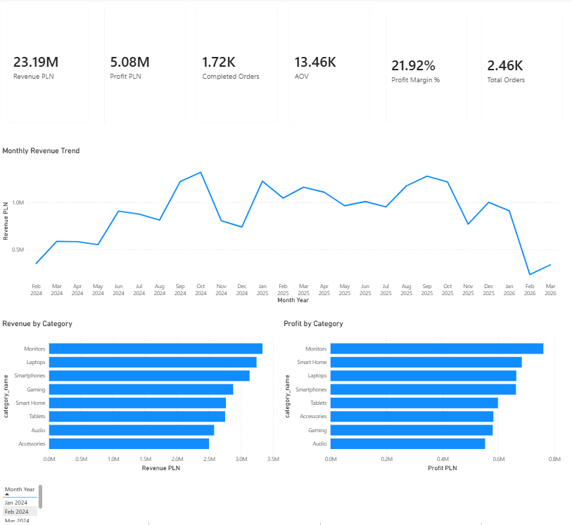

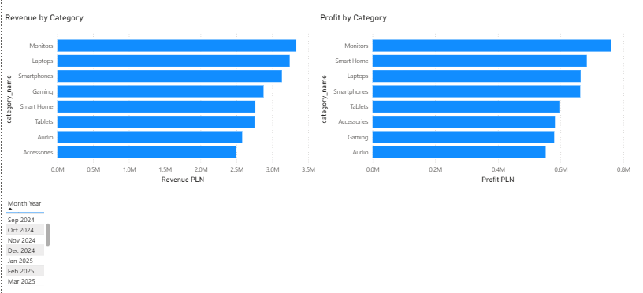

Product & Customer Analysis

The second page focuses on the two sides of the business that directly generate revenue: products and customers.

It helps identify the strongest products and categories as well as the customers who contribute the most to sales.

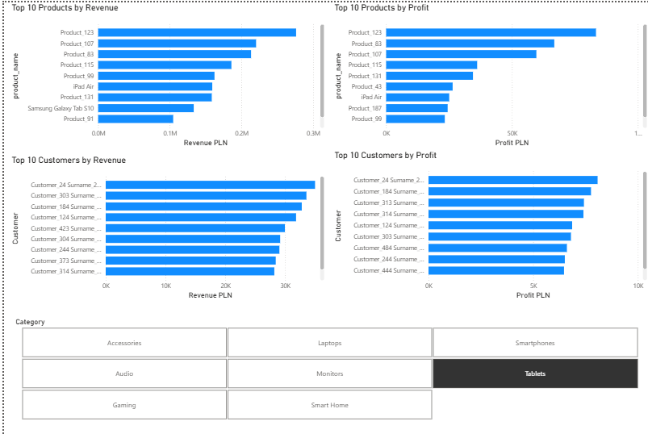

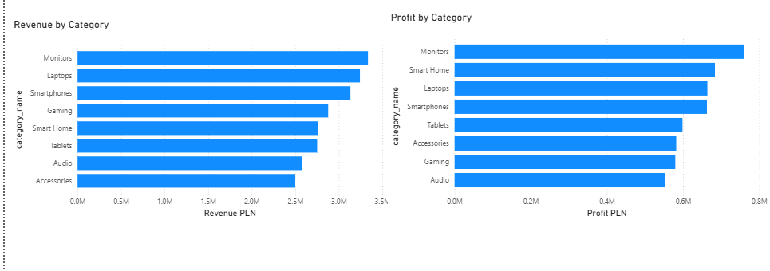

Sales Performance

The third page looks more closely at sales performance and makes it easier to compare different parts of the business.

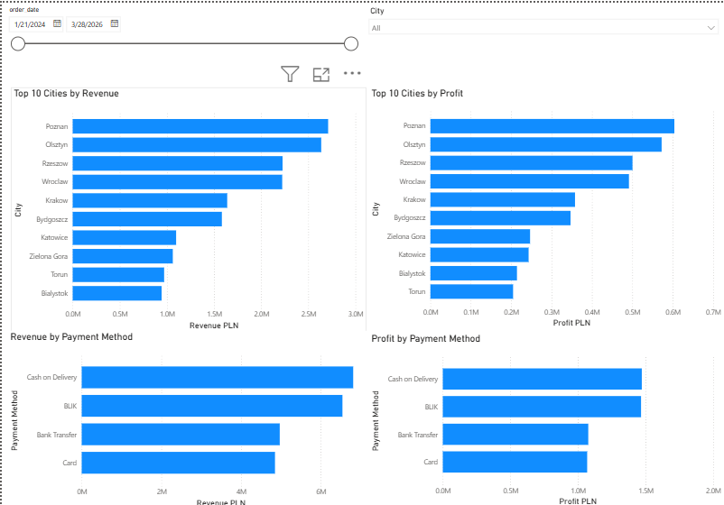

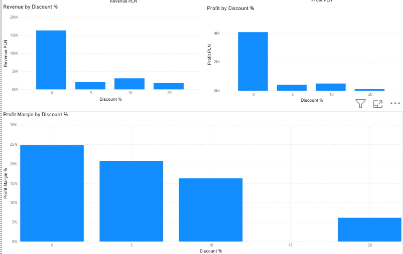

Order & Growth Analysis

The last page focuses on orders and growth over time. It complements the previous pages by showing how sales performance changes rather than only showing the current totals.

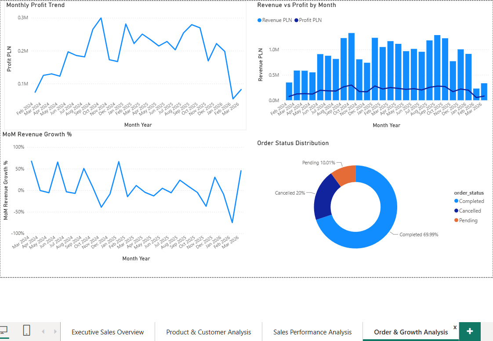

The dashboard also includes filters and interactive visuals so that the results can be explored instead of being limited to static charts.

The Power BI project file is available here:

```text
powerbi/Ecommerce_Sales_Analytics_Dashboard.pbix
```

# What I analyzed

Across SQL, Python and Power BI, I focused mainly on:

- revenue and profitability
- average order value
- sales and profit over time
- month-over-month revenue growth
- product performance
- category performance
- customer value
- customer revenue concentration
- sales by city
- payment methods
- discount impact
- order status distribution
- completed orders
- sales trends

One thing I wanted to avoid was creating visualizations without a business purpose. For each part of the project, I tried to connect the technical work with a question that could realistically be asked when analyzing an e-commerce business.

# Repository structure

```text
ecommerce-sales-analytics/
│
├── data/
│   └── sales_details.csv
│
├── images/
│   ├── Power BI dashboard screenshots
│   └── Python analysis charts
│
├── powerbi/
│   └── Ecommerce_Sales_Analytics_Dashboard.pbix
│
├── python/
│   └── sales_analysis.ipynb
│
├── sql/
│   ├── 01_database_setup.sql
│   ├── 02_insert_orders.sql
│   ├── 03_business_analysis.sql
│   ├── 04_views.sql
│   ├── 05_generate_large_dataset.sql
│   └── 06_indexes.sql
│
├── README.md
└── requirements.txt
```

# How to run the project

To reproduce the SQL part of the project, create a PostgreSQL database and run the scripts from the `sql` directory in numerical order.

The generated analytical data can then be exported to CSV. A prepared version is already available in:

```text
data/sales_details.csv
```

For the Python analysis, install the required libraries and open:

```text
python/sales_analysis.ipynb
```

The main Python libraries used in the notebook are:

```text
pandas
numpy
matplotlib
```

The Power BI dashboard can be opened with Power BI Desktop using the `.pbix` file from the `powerbi` directory.

# What I learned

This project helped me understand how different data analytics tools can work together in one workflow.

SQL was useful not only for querying the data, but also for designing the database, generating data and preparing reusable analytical structures.

Python gave me more flexibility for exploratory analysis, calculations and visualizations such as customer revenue concentration and month-over-month growth.

Power BI helped me turn the analysis into an interactive dashboard where the main results can be explored quickly.

Most importantly, the project gave me practical experience in moving from raw relational data to business questions, analysis, visualization and final presentation.

# About me

My name is Artem Zakharchuk. I am a third-year Computer Science Bachelor's student at the University of Lodz, Faculty of Mathematics and Computer Science.

I am currently developing my skills in data analytics, with a particular focus on SQL, Python and Power BI. I built this project to apply what I have learned in practice and to create a complete project that shows the full analytical process rather than isolated exercises.
